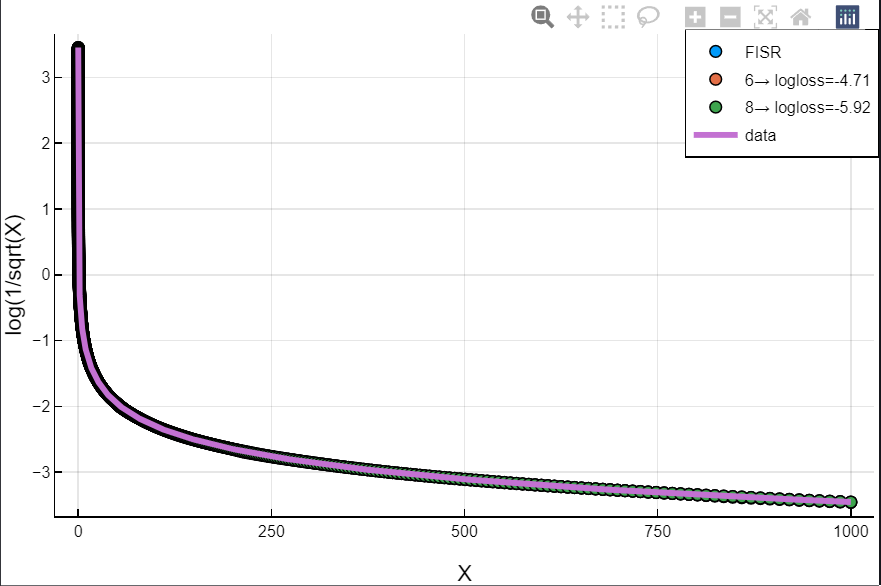
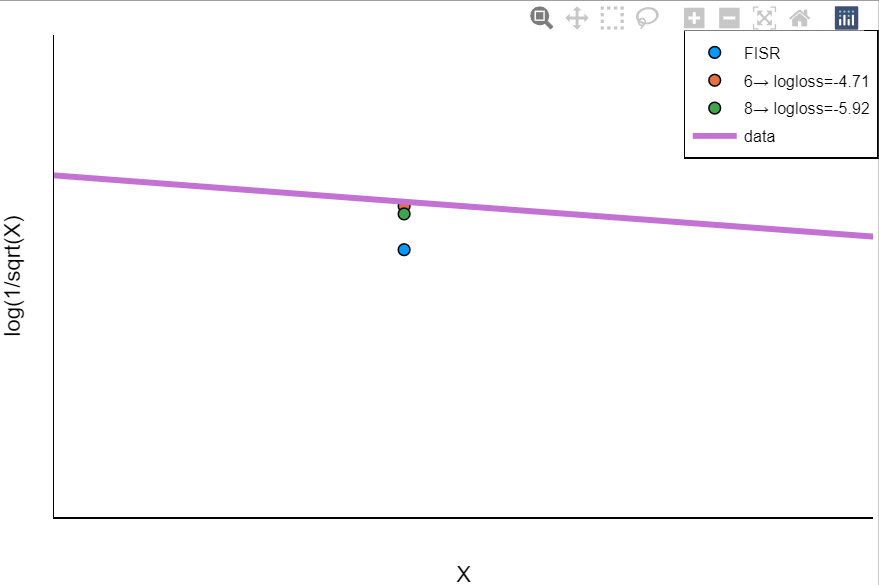
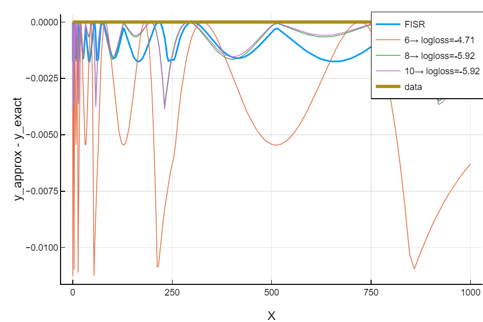

# FISR Discovery using SymbolicRegression.jl
___

## What
This script attempts to re-discover the [Fast Inverse Square Root](https://en.wikipedia.org/wiki/Fast_inverse_square_root) (FISR) function using symbolic regression.

## Why
I wanted to learn a bit about symbolic regression after seeing its utility at a conference. I also wanted to have a quick and non-trivial example on hand to refer to. This repo hopefully will serve as a template for anyone wanting to tackle that kind of quick project rather than a toy problem. 

## How
To search, we first define a few "magic" bitwise operations (`operators.jl`) that work on `Float32` values (as FISR does) that are then used as operators in the [SymbolicRegression.jl](https://github.com/MilesCranmer/SymbolicRegression.jl) package in Julia. I call them magic since they provide a wide net of tricks that do operations pretending the floating point value is just raw bits, with the hopes that the machine learning algorithm will be able to use them to construct the original FISR algorithm.    

It stays somewhat true to the discovery process, that is, it solves only the "evil floating point bit magic" part; leaving the Newton's Method iteration as something that's hard coded. I tried to make the operators as modular as possible, and at the end of that file combine them into a working implementation of the FISR function, proving a solution exists using only these operators. 

## Results

Right now this finds pretty competitive functions compared to FISR, but isn't able to find the exact magic number at least on my machine (and given the time I've allotted it).

I'm unsure if this is a fundamental issue (i.e., theres a magic number solution space, not a single number) or the specific FISR magic number is extremely hard to find via conventional optimizers. I suspect the former, as many of the solutions deviate in a very similar way to FISR from the ground truth values. 

## Improvements
- Include derivative information in the loss function
- Simplify the resulting "magic add" function to just a constant in the final solution. Right now it's kept as magic_add(input::float32, magic::float32) where the magic number is mapped to an integer (this way optimizers can actually search through magic numbers as if that space was continuous). 
- Make this a notebook!

Thanks to [Miles Cranmer](https://github.com/milescranmer) for helping me understand the tricks and intricacies of the library and the solution itself. I learned a lot in this project.

## To run this script
- First ensure Julia is installed on the machine (tested on 1.9).
- Install dependencies via `] activate .` followed by  `instantiate` in the repl's package manager when in the git's directory.
- run "main.jl". Precompilation will take some time. 
- View results. Note that running it in VSCode or some interactive session will be more useful since you can run the blocks at the end that display plots (e.g., `# testing various outputs`)

